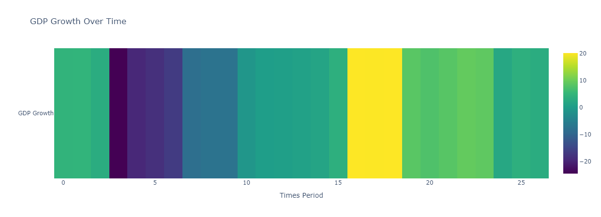
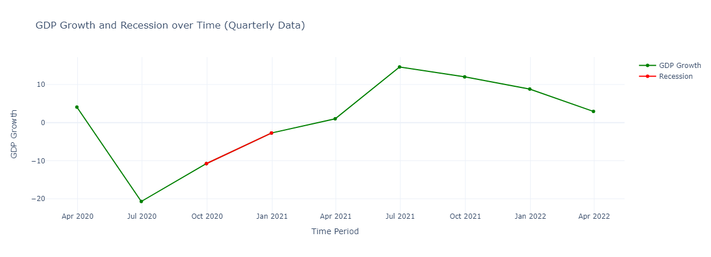
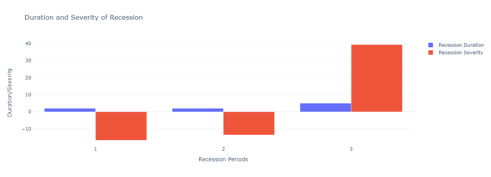

# Recession Analysis of India from Financial Year 2020 to 2021 using Pandas and Plotly

When the amount of money moving through the economy is low for two consecutive quarters, an economic situation known as a recession occurs. Low money circulation indicates that consumers are not making purchases at the market. Businesses suffer losses when customers don't spend money, which causes a slowdown in the economy and layoffs.

